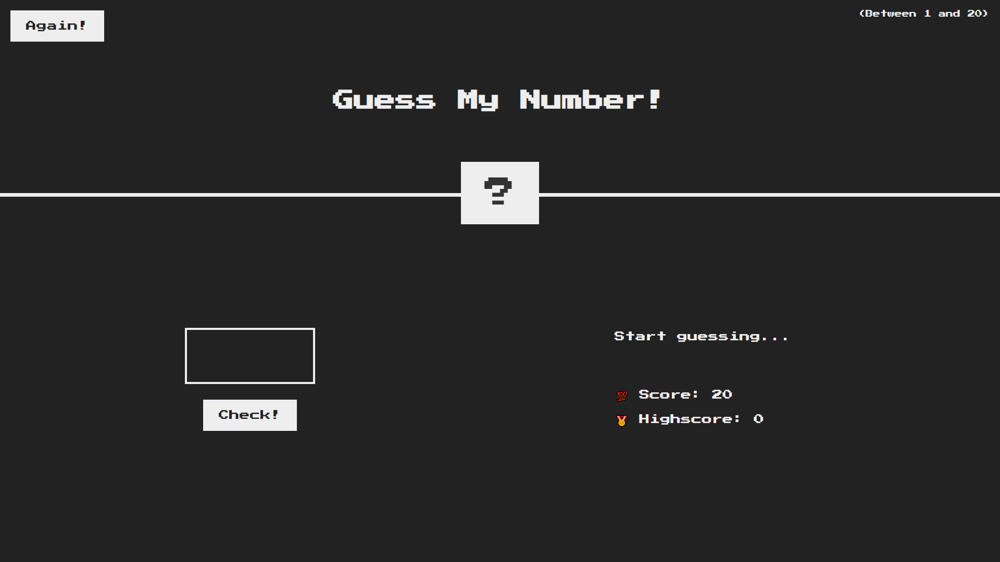
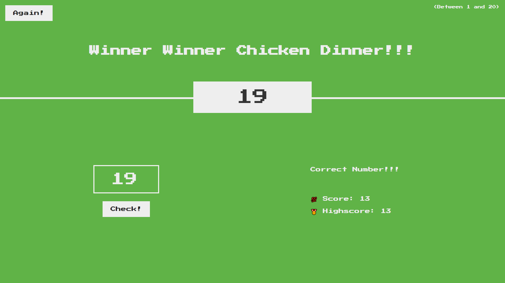
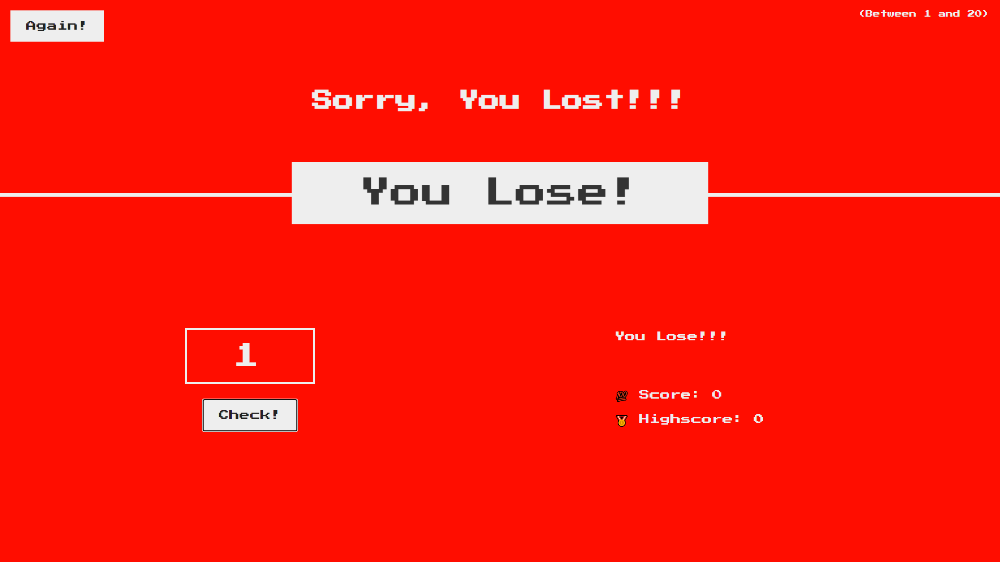

# Guess My Number Game

> Number guessing game written in JavaScript. 

> `Higher score` is awarded through `fewer guesses` 

> If correct number is not guessed and counter reaches `0` then it's `game over`. 

